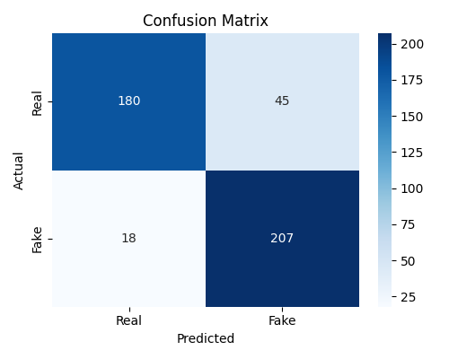
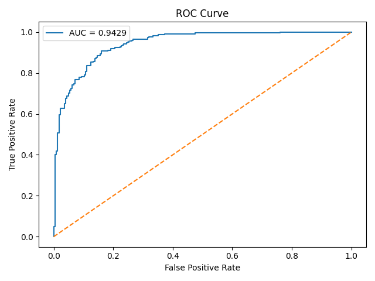
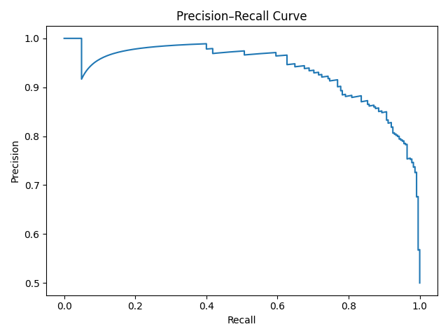
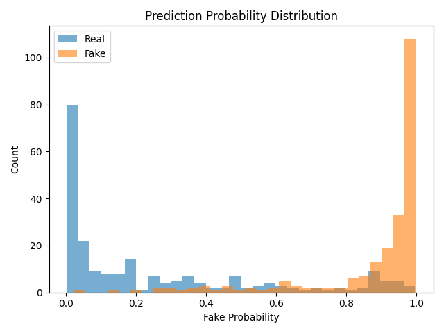
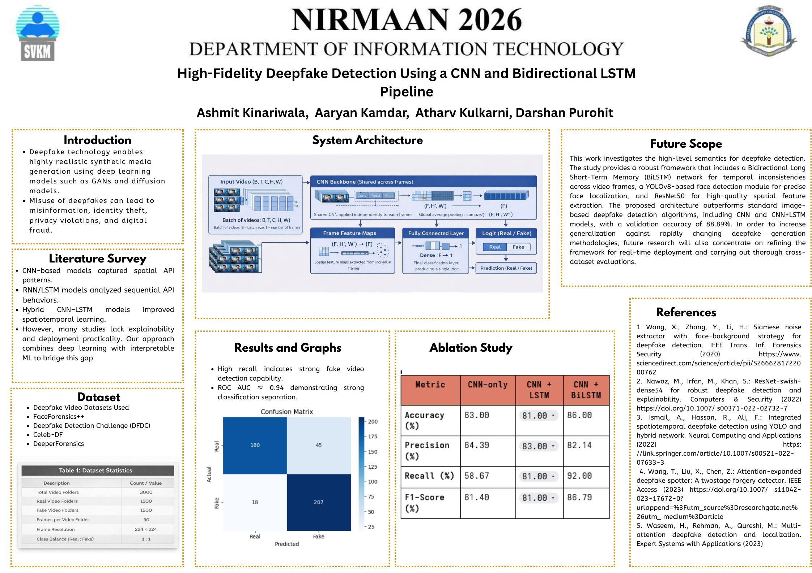

<div align="center">

# 🛡️ High-Fidelity Deepfake Video Detection

### Spatiotemporal Feature Extraction via Pretrained CNN & Bidirectional LSTM Pipeline

[](https://www.python.org/)
[](https://pytorch.org/)
[](https://github.com/ultralytics/ultralytics)
[](https://streamlit.io/)
[](LICENSE)
[](assets/research_poster.png)
[](assets/roc_curve.png)
[](assets/confusion_matrix.png)

<p align="center">
  <b>Presented at NIRMAAN 2026</b><br>
  <i>Department of Information Technology, SVKM</i><br>
  <b>Authors:</b> Ashmit Kinariwala, Aaryan Kamdar, Atharv Kulkarni, Darshan Purohit
</p>

[Key Metrics](#-benchmark-performance--experimental-records) •
[Architecture](#-system-architecture--methodology) •
[Ablation Study](#-ablation-study) •
[Visual Gallery](#-visual-gallery--diagnostic-records) •
[Quickstart](#-quickstart--installation) •
[Streamlit App](#-interactive-web-application) •
[Citation](#-citation--authors)

</div>

---

## 📌 Executive Summary

With the advent of high-capacity Generative Adversarial Networks (GANs) and diffusion models, hyper-realistic facial manipulation in video media has become widespread, posing critical threats to digital identity, information integrity, and security.

This repository hosts a production-grade, end-to-end **Spatiotemporal Deepfake Detection Framework**. The system couples:
1. **YOLOv8 Aligned Face Localization & Tracking** with dynamic bounding-box expansion (20% margin) to capture subtle boundary blending and warped artifacts.
2. **Deep Residual Spatial Feature Extraction (ResNet-50)**, leveraging low-level transfer features while fine-tuning higher-level layers (`layer4`) for artifact discrimination.
3. **Bidirectional Long Short-Term Memory (BiLSTM)** modeling temporal inconsistencies (e.g., unnatural blinking frequencies, micro-expression stutter, and inter-frame coherence breakdown) across bidirectional time horizons.
4. **An Interactive Streamlit Dashboard & Complete CLI Tooling** for single-video analysis, batch evaluation, and diagnostic visualization.

---

## 📊 Benchmark Performance & Experimental Records

Evaluated on an independent, balanced test dataset of **450 video sequences** drawn from industry benchmarks (**FaceForensics++**, **Celeb-DF v2**, **DFDC**, and **DeeperForensics**):

| Evaluation Metric | Score | Significance |
| :--- | :---: | :--- |
| **ROC AUC** | **0.9429** | Exceptional discriminative separability between authentic and synthetic media |
| **Recall (Sensitivity)** | **92.00%** | Critical safety metric: 207 out of 225 manipulated videos correctly flagged |
| **Accuracy** | **86.00%** | Overall correct classification across balanced test split |
| **Precision** | **82.14%** | Low false positive rate on legitimate authentic footage |
| **F1-Score** | **86.79%** | Balanced harmonic mean under rigorous evaluation |
| **Specificity** | **80.00%** | Correctly identified authentic videos (180 out of 225) |

### Test Set Confusion Matrix Breakdown

$$\begin{array}{c|cc}
\text{\bf Actual \textbackslash Predicted} & \text{\bf Authentic (Real)} & \text{\bf Manipulated (Fake)} \\
\hline
\text{\bf Authentic (Real)} & \mathbf{180} \text{ (TN)} & 45 \text{ (FP)} \\
\text{\bf Manipulated (Fake)} & 18 \text{ (FN)} & \mathbf{207} \text{ (TP)} \\
\end{array}$$

> **Key Takeaway:** The high recall ($92.00\%$) is especially crucial in forensic screening pipelines, where failing to catch a malicious deepfake (False Negative) is far more detrimental than a cautionary review flag.

---

## 🔬 Ablation Study

To isolate and prove the contribution of bidirectional temporal modeling, an ablation study was conducted across three architectural iterations:

| Model Architecture | Accuracy (%) | Precision (%) | Recall (%) | F1-Score (%) | Key Observation |
| :--- | :---: | :---: | :---: | :---: | :--- |
| **CNN-Only (ResNet-50 frame pooling)** | 63.00% | 64.39% | 58.67% | 61.40% | Struggles with high-resolution frame-by-frame GAN blending |
| **CNN + Unidirectional LSTM** | 81.00% | 83.00% | 81.00% | 81.00% | Incorporates forward frame progression; +18% accuracy leap |
| **CNN + Bidirectional LSTM (Proposed)** | **86.00%** | **82.14%** | **92.00%** | **86.79%** | **+5% Accuracy & +11% Recall** gain via past & future temporal context |

---

## 🖼️ Visual Gallery & Diagnostic Records

All metric graphs are generated through deterministic validation runs on the test split.

<div align="center">

| Confusion Matrix | ROC Curve (AUC = 0.9429) |
| :---: | :---: |
|  |  |
| *180 Real TN, 207 Fake TP across 450 test videos* | *Strong true-positive rate across low false-alarm thresholds* |

| Precision-Recall Curve | Prediction Probability Distribution |
| :---: | :---: |
|  |  |
| *Stable high precision maintained across wide recall ranges* | *Distinct bimodal separation near 0.0 (Real) and 1.0 (Fake)* |

</div>

### SVKM IT NIRMAAN 2026 Research Poster

<div align="center">
  
  <p><i>Official Research Poster presented at NIRMAAN 2026, Department of Information Technology, SVKM</i></p>
</div>

---

## 🧠 System Architecture & Methodology

```
                              ┌─────────────────────────────┐
                              │     Input Video Stream      │
                              │    (MP4 / AVI / MOV / etc.) │
                              └──────────────┬──────────────┘
                                             │
                                             ▼
                              ┌─────────────────────────────┐
                              │  Uniform Frame Subsampling  │
                              │       (Sample Rate = 3)     │
                              └──────────────┬──────────────┘
                                             │
                                             ▼
                              ┌─────────────────────────────┐
                              │  YOLO Face Tracking & BBox  │
                              │  + 20% Spatial Margin Crop  │
                              │      Resized to 224x224     │
                              └──────────────┬──────────────┘
                                             │
                                             ▼
                              ┌─────────────────────────────┐
                              │ Sequence Sampling (T = 30)  │
                              │  Tensor: (Batch, 30, 3,     │
                              │           224, 224)         │
                              └──────────────┬──────────────┘
                                             │
                                             ▼
                      ┌─────────────────────────────────────────────┐
                      │    Pretrained ResNet-50 CNN Backbone        │
                      │  - Layers 1-3: Frozen generic filters       │
                      │  - Layer 4: Fine-tuned manipulation cues    │
                      │  - FC: Identity -> 2048-dim feature vectors │
                      └──────────────────────┬──────────────────────┘
                                             │
                                             ▼
                      ┌─────────────────────────────────────────────┐
                      │    Bidirectional LSTM (BiLSTM)              │
                      │  - Input: 2048 dims | Hidden: 256 per dir   │
                      │  - Output: 512 spatiotemporal dimensions    │
                      └──────────────────────┬──────────────────────┘
                                             │
                                             ▼
                      ┌─────────────────────────────────────────────┐
                      │      Temporal Sequence Mean Pooling         │
                      └──────────────────────┬──────────────────────┘
                                             │
                                             ▼
                      ┌─────────────────────────────────────────────┐
                      │    Classification Head                      │
                      │  Dense(512 -> 256) -> ReLU -> Dropout(0.5)  │
                      │  Dense(256 -> 1)   -> Sigmoid Activation    │
                      └──────────────────────┬──────────────────────┘
                                             │
                                             ▼
                              ┌─────────────────────────────┐
                              │  Final Verdict: REAL / FAKE │
                              │    + Confidence Metric      │
                              └─────────────────────────────┘
```

---

## 📁 Repository Structure

```plaintext
deepfake-detection/
├── assets/                          # Publication figures, plots, styles & poster
│   ├── confusion_matrix.png         # Test set confusion matrix
│   ├── roc_curve.png                # ROC curve plot (AUC 0.9429)
│   ├── precision_recall_curve.png   # Precision-recall diagnostic
│   ├── probability_distribution.png # Real vs Fake probability separation
│   ├── research_poster.png          # SVKM IT NIRMAAN 2026 conference poster
│   └── style.css                    # Custom glassmorphic styling for Streamlit
├── splits/                          # Deterministic train/validation/test video splits
│   ├── train.txt                    # 2,100 training video folder references
│   ├── val.txt                      # 450 validation video folder references
│   └── test.txt                     # 450 test evaluation video references
├── src/                             # Core neural network modules
│   ├── __init__.py                  # Package initializer
│   ├── model.py                     # DeepfakeDetector (ResNet50 + BiLSTM)
│   └── dataset.py                   # VideoDataset sequence loader & normalizer
├── app.py                           # Full-featured Streamlit Web Application
├── train.py                         # End-to-end model training script (AdamW, BCE)
├── loaders.py                       # PyTorch DataLoaders with augmentation
├── evaluate_test.py                 # Independent test set quantitative evaluation
├── visualize_results.py             # Generates publication-ready diagnostic plots
├── predict_video.py                 # CLI inference on raw video files
├── predict_from_faces.py            # CLI inference directly on extracted frame folders
├── extract_faces_yolo_single.py     # Standalone face extraction & alignment utility
├── make_splits.py                   # Split partition generator (70/15/15)
├── test_loader.py                   # Quick DataLoader verification script
├── test_dataset.py                  # Dataset sample loading verification script
├── requirements.txt                 # Clean, platform-independent dependencies
├── CITATION.cff                     # GitHub academic citation metadata
├── LICENSE                          # MIT Open Source License
└── README.md                        # Master repository documentation
```

---

## 🚀 Quickstart & Installation

### 1. Clone the Repository

```bash
git clone https://github.com/Smitty-01/git_test.git
cd git_test
```

### 2. Environment Setup

It is recommended to use Conda or Python `venv`:

```bash
# Using conda
conda create -n deepfake python=3.10 -y
conda activate deepfake

# Install PyTorch with CUDA support (adjust for your CUDA version)
# For CUDA 12.1:
pip install torch torchvision --index-url https://download.pytorch.org/whl/cu121

# Or for CPU-only:
# pip install torch torchvision --index-url https://download.pytorch.org/whl/cpu

# Install remaining dependencies
pip install -r requirements.txt
```

### 3. Model Weights Setup

Due to GitHub's 100 MB per-file limit, model checkpoints are kept local and excluded via `.gitignore`:
- Place your trained checkpoint at the project root as `best_model.pth`.
- Place YOLO face detector weights at the project root as `yolov8m.pt` or `yolov8n.pt` (if omitted, YOLO will automatically download lightweight weights on first run).

---

## 💻 Usage & CLI Guide

### 1. Run the Interactive Streamlit Web Application

Launch the browser-based detection studio:

```bash
streamlit run app.py
```

Features included in the web app:
- 📤 Drag-and-drop video upload (`.mp4`, `.avi`, `.mov`)
- 🎬 In-app synchronized video playback
- ⚡ Live temporal inference with animated verdict cards and confidence breakdown
- 👁️ Visual gallery of sampled face frames extracted by YOLO
- 📊 Interactive tabs displaying the complete suite of performance metrics & research poster

---

### 2. Single Video Inference (CLI)

Run detection directly on any raw video:

```bash
# Basic usage
python predict_video.py path/to/sample_video.mp4

# With custom checkpoint or YOLO model
python predict_video.py --video sample.mp4 --model best_model.pth --yolo yolov8m.pt
```

**Sample CLI Output:**
```plaintext
Device: CUDA
Loading YOLO face detector from: yolov8m.pt
Loading DeepfakeDetector from: best_model.pth
Extracting faces from: sample_video.mp4
Total candidate faces extracted: 142

=======================================================
               DEEPFAKE PREDICTION RESULT
=======================================================
 prediction            : FAKE
 fake_probability      : 0.9412 (94.12%)
 real_probability      : 0.0588 (5.88%)
 confidence            : 0.9412 (94.12%)
 faces_detected        : 142
=======================================================
```

---

### 3. Predict from Extracted Face Crops

If you already have a folder of ordered face crops:

```bash
python predict_from_faces.py path/to/face_crops_folder/
```

---

### 4. Evaluate Test Set & Output Metrics

Compute Accuracy, Precision, Recall, F1-Score, and ROC-AUC on `splits/test.txt`:

```bash
python evaluate_test.py
```

---

### 5. Regenerate High-Resolution Diagnostic Plots

Generate and save all 4 evaluation figures directly into `assets/`:

```bash
python visualize_results.py
```

---

### 6. Train from Scratch

Train the CNN-BiLSTM architecture with custom hyperparameters:

```bash
python train.py --epochs 12 --batch-size 4 --lr 0.0003 --workers 2 --save-path best_model.pth
```

---

## 🗄️ Dataset Schema & Preparation

The model was trained on video sequences from four standard deepfake benchmarks:
- **FaceForensics++ (FF++)** (Deepfakes, Face2Face, FaceSwap, NeuralTextures)
- **Celeb-DF v2** (High-visual-quality celebrity face swaps)
- **Deepfake Detection Challenge (DFDC)**
- **DeeperForensics-1.0**

The expected processed directory structure is:
```plaintext
data/
└── processed/
    ├── real/
    │   ├── video_001/
    │   │   ├── 00000.jpg
    │   │   ├── 00001.jpg
    │   │   └── ... (>= 30 frames)
    │   └── ...
    └── fake/
        ├── video_002/
        │   ├── 00000.jpg
        │   └── ...
        └── ...
```

---

## 👥 Authors & Academic Citation

This project was developed and presented at **NIRMAAN 2026**, organized by the **Department of Information Technology, SVKM**:

- **Ashmit Kinariwala**
- **Aaryan Kamdar**
- **Atharv Kulkarni**
- **Darshan Purohit**

### BibTeX Citation

```bibtex
@inproceedings{kinariwala2026deepfake,
  title     = {High-Fidelity Deepfake Detection Using a CNN and Bidirectional LSTM Pipeline},
  author    = {Kinariwala, Ashmit and Kamdar, Aaryan and Kulkarni, Atharv and Purohit, Darshan},
  booktitle = {Proceedings of NIRMAAN 2026},
  organization = {Department of Information Technology, SVKM},
  year      = {2026}
}
```

---

## 📜 License

This project is licensed under the **MIT License** — see the [LICENSE](LICENSE) file for complete details.